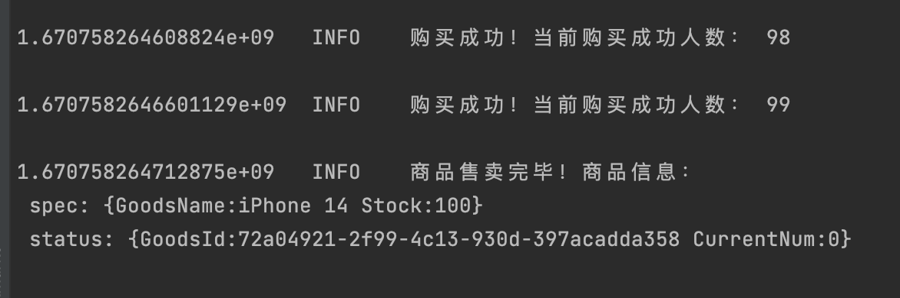

# operator 学习开发_K8s-spikev_02

## 需求明确

创建商品，指定商品库存。创建用户群体，指定用户群体数量。

1. Goods

   ```go
   type GoodsSpec struct {
   	GoodsName string `json:"goodsName,omitempty"`
   	// 初始库存
   	Stock int `json:"stock,omitempty"`
   }
   
   type GoodsStatus struct {
   	// 商品ID
   	GoodsId string `json:"goodsId,omitempty"`
   	// 当前商品数
   	CurrentNum int `json:"currentNum,omitempty"`
   }
   ```

2. Masses

   ```go
   type MassesSpec struct {
   	// 买家所属地
   	PersonAddr string `json:"personAddr,omitempty"`
   	// 买家人数
   	PersonNum int `json:"personNum,omitempty"`
   }
   
   // MassesStatus defines the observed state of Masses
   type MassesStatus struct {
   	// 用户群体ID
   	PersonsId string `json:"persons_id,omitempty"`
   	// 购买成功数
   	SuccessNum int `json:"SuccessNum,omitempty"`
   	// 购买失败数
   	FailNUm int `json:"failNUm,omitempty"`
   }
   ```

   

## 实现

1. 创建API对象

   1. 秒杀商品：Goods

      ```sh
      kubebuilder create api --group myapp --version v2 --kind Goods
      ```

   2. 买家：Masses

      ```sh
      kubebuilder create api --group myapp --version v2 --kind Masses
      ```


## 测试

1. 初始化商品对象

   ```yaml
   apiVersion: myapp.spike.com/v2
   kind: Goods
   metadata:
     name: goods1
     namespace: default
   spec:
     goodsName: iPhone 14
     stock: 100
   
   ```

   初始化用户群体对象

   ```yaml
   apiVersion: myapp.spike.com/v2
   kind: Masses
   metadata:
     name: ma1
     namespace: default
   spec:
     personAddr: 成都
     personNum: 2000
   ```





