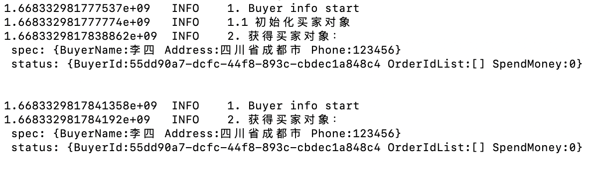
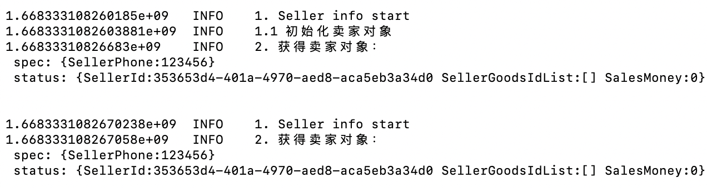
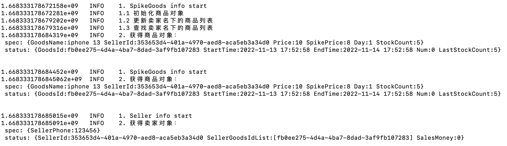
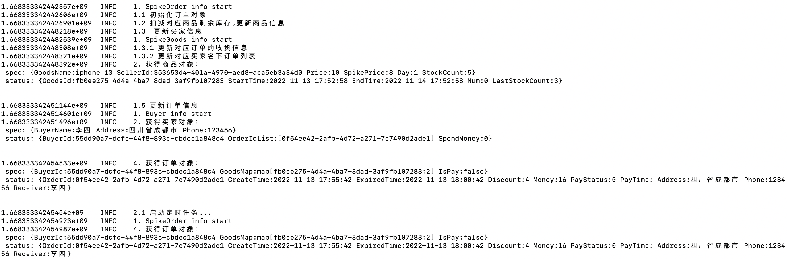
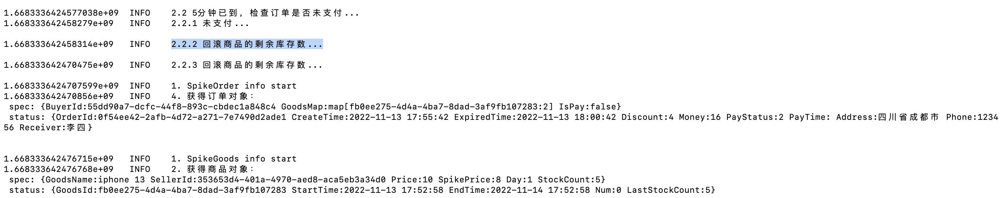
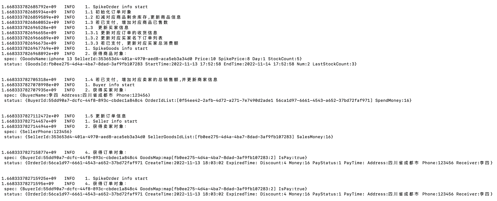
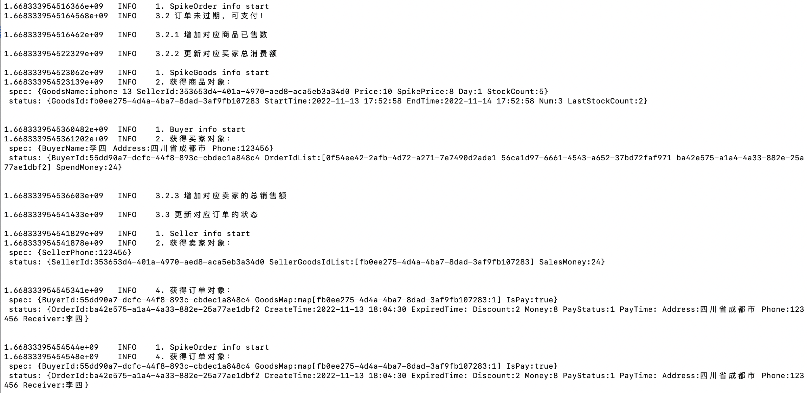

# operator 学习开发_K8s-spikev

[项目地址](https://github.com/YKL2436542696/k8s-spikev2)

## 环境准备

1. 需要服务器端的k8s环境，并把`~/.kube/config`文件复制到本地。（我服务端K8s版本为1.22）

2. 需要本地安装kubectl 

   * 用curl在mas OS系统上安装

     ```shell
     ## 下载最新版本
     curl -LO "https://dl.k8s.io/release/$(curl -L -s https://dl.k8s.io/release/stable.txt)/bin/darwin/arm64/kubectl"
     
     ## 下载指定版本
     curl -LO "https://dl.k8s.io/release/v1.22.4/bin/darwin/arm64/kubectl"
     
     ## 验证可执行文件
     curl -LO "https://dl.k8s.io/release/$(curl -L -s https://dl.k8s.io/release/stable.txt)/bin/darwin/arm64/kubectl.sha256"
     
     ## 根据校验和文件，验证 kubectl：
     echo "$(<kubectl.sha256)  kubectl" | shasum -a 256 --check
     ## 验证通过：
     kubectl: OK
     
     ## 添加可执行权限，移动到local/bin里
     chmod +x ./kubectl
     sudo mv ./kubectl /usr/local/bin/kubectl
     
     # 验证
     kubectl version
     ```

3. 需要本地安装kubebuilder

   * [下载地址](https://github.com/kubernetes-sigs/kubebuilder/releases/tag/v3.4.0)

   * 应该下载最新版本的，3.4.0不支持M1型片的Mac开发

     ```sh
     mv kubebuilder_darwin_arm64 /usr/local/bin/kubebuilder
     chmod a+x /usr/local/bin/kubebuilder
     kubebuilder version
     ```

4. 安装kustomize

   [下载链接](https://github.com/kubernetes-sigs/kustomize/releases/tag/kustomize%2Fv4.5.4)

   把二进制可执行文件放到工程文件的bin目录中

   **要点：**

   >  Mac系统初始化的makefile文件中，对kustomize的下载是失效的，需要去掉kustomize的下载步骤！

   

## 程序设计

### 1. 对象设计

1. 秒杀商品

   ```go
   type SpikeGoodsSpec struct {
   	// 商品标题
   	GoodsName string `json:"goodsName,omitempty"`
   	// 商家ID
   	SellerId string `json:"sellerId,omitempty"`
   	// 原价
   	Price int `json:"price,omitempty"`
   	// 秒杀价格
   	SpikePrice int `json:"spikePrice,omitempty"`
   	// 活动持续时间
   	Day int `json:"day,omitempty"`
   	// 总库存数
   	StockCount int `json:"stockCount,omitempty"`
   }
   type SpikeGoodsStatus struct {
   	// 商品ID
   	GoodsId string `json:"goodsId,omitempty"`
   	// 活动开始时间
   	StartTime string `json:"start_time,omitempty"`
   	// 活动结束时间
   	EndTime string `json:"endTime,omitempty"`
   	// 已售商品数
   	Num int `json:"num,omitempty"`
   	// 剩余库存数
   	LastStockCount int `json:"lastCount,omitempty"`
   }
   ```

2. 秒杀订单

   ```go
   type SpikeOrderSpec struct {
   	// 买家ID
   	BuyerId string `json:"buyerId,omitempty"`
   	// 秒杀商品列表
   	GoodsMap map[string]int `json:"goodsMap,omitempty"`
   	// 是否付款
   	IsPay bool `json:"isPay,omitempty"`
   }
   type SpikeOrderStatus struct {
   	// 订单ID
   	OrderId string `json:"orderId,omitempty"`
   	// 订单创建时间
   	CreateTime string `json:"createTime,omitempty"`
   	// 订单过期时间
   	ExpiredTime string `json:"expiredTime,omitempty"`
   	// 优惠金额
   	Discount int `json:"discount,omitempty"`
   	// 需付金额
   	Money int `json:"money,omitempty"`
   	// 订单状态 0 未支付 1 已支付 2 已过期
   	PayStatus string `json:"payStatus,omitempty"`
   	// 订单支付时间
   	PayTime string `json:"payTime,omitempty"`
   	// 收货地址
   	Address string `json:"address,omitempty"`
   	// 收货电话
   	Phone string `json:"phone,omitempty"`
   	// 收货人
   	Receiver string `json:"receiver,omitempty"`
   }
   ```

3. 买家

   ```go
   type BuyerSpec struct {
   	// 买家账号名
   	BuyerName string `json:"buyerName,omitempty"`
   	// 买家收货地址
   	Address string `json:"address,omitempty"`
   	// 买家电话
   	Phone string `json:"phone,omitempty"`
   }
   type BuyerStatus struct {
   	// 买家ID
   	BuyerId string `json:"buyerId,omitempty"`
   	// 买家订单ID列表
   	OrderIdList []string `json:"orderList,omitempty"`
   	// 买家总消费额
   	SpendMoney int `json:"spendMoney,omitempty"`
   }
   ```

4. 卖家

   ```go
   type SellerSpec struct {
   	// 卖家电话
   	SellerPhone string `json:"sellerPhone,omitempty"`
   }
   type SellerStatus struct {
   	// 卖家ID
   	SellerId string `json:"sellerId,omitempty"`
   	// 卖家发布的秒杀商品ID列表
   	SellerGoodsIdList []string `json:"sellerGoodsList,omitempty"`
   	// 卖家总销售额
   	SalesMoney int `json:"salesMoney,omitempty"`
   }
   ```

   

### 2. 逻辑

#### 初始化

1. 创建商品crd对象时

   - [x] 根据输入spec中的活动持续时间，算出活动截止时间，更新该对象的status的活动开始时间、活动截止时间、已售商品数置为0、生成唯一商品ID、剩余库存数等于总库存数
   - [x] 生成订单时扣减对应商品crd对象的剩余库存数，生成对应买家名下的订单列表
   - [x] 若订单超时过期则回滚剩余库存数，且无法支付，正常支付则把过期时间置空
   - [x] 若订单正常支付则更新对应商品已售数

2. 创建订单crd对象时

   - [x] 首先更新该对象的status字段，生产订单ID、订单创建时间、订单过期时间、订单状态，
   - [x] 根据spec字段的商品列表，算出需付金额、优惠金额，
   - [x] 根据用户ID更新收货地址、收货电话、收货人。

3. 创建买家crd对象

   - [x] status字段，首先生成对应的卖家sID、总消费额置0
   - [x] 创建订单时，更新对应买家的订单列表字段
   - [x] 订单支付后，更新总消费额

4. 创建商家crd对象

   - [x] status字段，首先生成对应的卖家ID
   - [x] 创建商品时，更新对应卖家的商品列表字段
   - [x] 订单支付后，更新对应卖家的总销售额

   

## 程序实现

### 1. 项目初始化

1. init项目

   ```sh
   kubebuilder init --domain spike.com --owner ykl --project-name k8s-spike-v2
   ```

2. 创建API对象

   1. 秒杀商品：SpikeGoods

      ```sh
      kubebuilder create api --group myapp --version v1 --kind SpikeGoods
      ```

   2. 秒杀订单：SpikeOrder

      ```sh
      kubebuilder create api --group myapp --version v1 --kind SpikeOrder
      ```

   3. 用户：Buyer

      ```sh
      kubebuilder create api --group myapp --version v1 --kind Buyer
      ```

   4. 卖家：Seller

      ```sh
      kubebuilder create api --group myapp --version v1 --kind Seller
      ```

   `make install`安装这些CRD

### 2. Controller 逻辑

重点为`spikegoods_controller`和`spikeorder_controller`

1. 商品逻辑：

   1. 通过检测商品的ID是否为空字符串来判断，该商品是否是初次上架，若是则初始化商品对象。

      ```go
      	log.Log.Info("1. SpikeGoods info start")
      	spikeGoods := &myappv1.SpikeGoods{}
      	if err := r.Get(ctx, req.NamespacedName, spikeGoods); err != nil {
      		log.Log.Error(err, "获取商品对象出错")
      	} else {
      		// 如果是第一次创建,更新买家的status字段信息
      		if spikeGoods.Status.GoodsId == "" {
      			log.Log.Info("1.1 初始化商品对象")
      			if err = initUpdateGoods(ctx, spikeGoods, r); err != nil {
      				return ctrl.Result{}, nil
      			}
      		}
      		log.Log.Info(fmt.Sprintln("2. 获得商品对象：", spikeGoods.String()))
      	}
      ```

   2. 初始化商品逻辑。

      生成商品ID，商品活动开始时间、结束时间，并进行更新操作商品。

      ```go
      func initUpdateGoods(ctx context.Context, spikeGoods *myappv1.SpikeGoods, r *SpikeGoodsReconciler) error {
      	spikeGoods.Status.GoodsId = uuid.New().String()
      	now := time.Now()
      	spikeGoods.Status.StartTime = now.Format("2006-01-02 15:04:05")
      	day := spikeGoods.Spec.Day
      	spikeGoods.Status.EndTime = now.AddDate(0, 0, day).Format("2006-01-02 15:04:05")
      	spikeGoods.Status.LastStockCount = spikeGoods.Spec.StockCount
      
      	if err := r.Status().Update(ctx, spikeGoods); err != nil {
      		log.Log.Error(err, "更新goods.status字段信息失败")
      		return err
      	} else {
          ....
          // 还需要更新卖家名下的商品列表
          ...
        }
      ```

2. 订单逻辑

   1. 通过检测订单的ID，来判断是否是初次生成订单，若是则进行该订单的初始化，且判断是否立即支付，否则开启一个5分钟的定时任务，5分钟后判断订单是否支付，否则将订单过期。
   2. 初始化订单逻辑
      1. 订单：计算订单创建时间、订单过期时间**（若立即支付则置为空字符）**、收货信息
      2. 商品：扣减对应商品剩余库存**（若立即支付则增加商品已售数量）**
      3. 买家：更新对应买家名下订单列表**（若立即支付，更新对应买家总消费额）**
      4. 卖家：**（若已支付，增加对应卖家的总销售额）**
   3. 当资源发生变化时，判断该订单`spec.isPay == true`,`Status.PayStatus == "0"`,`Status.ExpiredTime != ""`,则判断该变化为支付，执行支付方法。
      1. 支付方法也要先判断是否过期，过期则会滚商品的剩余库存，且返回err,无法支付
      2. 为过期，则相应的改变订单状态、增加对应商品已售数、更新对应买家总消费额、增加对应卖家的总销售额。


### 3. Controller 构建镜像

使用3.4.0版本的kubebuilder ，出现了一系列的macOS arm64 不支持的问题，故尝试升级最新版本3.7.0。

```shell
# 镜像构建成功
make docker-build docker-push IMG=xiaoyie/spike-controller:001
```

镜像准备好后，在k8s部署`controller`

```sh
make deploy IMG=xiaoyie/spike-controller:001
```

该pod中有两个容器：

```shell
ykl@KailondeMBP k8s-spikev2 % kubectl get pod -n k8s-spike-v2-system
NAME                                               READY   STATUS    RESTARTS   AGE
k8s-spike-v2-controller-manager-5b9bb947d7-dml8z   2/2     Running   0          9m46s

ykl@KailondeMBP k8s-spikev2 % kubectl describe pod  k8s-spike-v2-controller-manager-5b9bb947d7-dml8z  -n k8s-spike-v2-system 
```

可以看到该pod上有两个容器，

```sh

	Containers:
  kube-rbac-proxy:
    Container ID:  docker://ec982adebb2aee2466d5f57808a2d0acd3d68393ecde7cac7dbdd574f212cadc
    Image:         gcr.io/kubebuilder/kube-rbac-proxy:v0.13.0
    ...
  manager:
    Container ID:  docker://6c5b4ae068eaab15cb9fb014203babc76898b7cd9a3fd60655841e6744129421
    Image:         xiaoyie/spike-controller:001
    ...

```

查看manager容器的日志：

```sh
kubectl logs -f k8s-spike-v2-controller-manager-5b9bb947d7-dml8z -n k8s-spike-v2-system -c manager
```


## 实现

### 各资源创建

1. 创建买家

   

2. 创建卖家

   

3. 创建一个商品

   

4. 创建一个订单,且暂时不支付，商品库存会暂时扣减

   

   等待过期，库存回滚

   

5. 创建一个订单，且立即支付

   

6. 创建一个订单，先不支付。然后通过`kubectl edit spikeorder order3 `,将`isPay`字段修改为true

   

## 未实现逻辑设想

1. 还未实现对这些crd资源删除时的控制。比如跟商品和订单与用户名下的订单列表、商家名下的商品列表都有关联，如果删除应该要进行校验，若有关联无法删除。

   百度实现方案，可以通过 k8s finalizers 来控制crd对象的删除

   ```go
   // IsExistInFinalizers 是否存在于finalizers，finalizers 是人为删除动作添加的，只要finalizers有值则删除无法顺利进行，直到finalizers为空；
   func (b *Buyer) IsExistInFinalizers(podName string) bool {
   	for _, fPodName := range b.Finalizers {
   		if podName == fPodName {
   			return true
   		}
   	}
   	return false
   }
   ```

2. 还应该考虑持久化问题，目前的想法时，可以在生成各资源的时候，同步数据到mysql表里。

3. 秒杀的场景，因为是一个高并发的场景。生成订单的时候，不管有没有支付，都先扣减了商品的剩余库存，然后在剩下的5分钟内，若支付了永久扣，若没支付过期了就回滚商品数。

4. 还没有实现很多校验，比如商品库存为0，用户就无法将该商品加入自己订单了

5. 可以通过webhook，实现一些外部的处理。比如若一些字段没有填，webhook将对字段进行默认值的赋值，对一些字段的合法性校验。


## 问题

### 1. 为什么Reconcile方法会执行两次

因为Kubernetes 控制器会监视资源的创建/更新/删除事件，并触发 `Reconcile` 函数作为响应。整个调整过程被称作 “Reconcile Loop”（调谐循环）或者 “Sync Loop”（同步循环）。

创建操作会执行一次，初始化更新又会执行一次


### 2. Make file 执行 make test 。出现：unable to find a version that was supported for platform darwin/arm64

使用的版本是kubebuilder 3.4.0 ，github上说明了其对Mac M芯片，arm芯片的支持情况。

> 我们现在发布 Darwin arm64（Apple Silicon）的 Kubebuilder 二进制文件。 然而，并非所有 Kubebuilder 所依赖的工具都支持这种架构，尤其是 Kustomize v3。 因此，Kubebuilder 仍然不支持 Darwin arm64（Apple Silicon）。

查看kubebuilder 的3.5.0版本，发现其版本说明中：

> 现在提供了用于 darwin/arm64 的 kubebuilder-tools (kubebuilder-tools-1.24.1-darwin-arm64.tar.gz)


### 3. Failed to pull image "gcr.io/kubebuilder/kube-rbac-proxy:v0.13.0": rpc error: code = Unknown desc =

在对controller进行镜像构建，部署到k8s时，出现了对kube-rbac-proxy镜像拉去不到的问题

> 其中出现问题：k8s服务端的docker无法拉去该镜像,  kube-rbac-proxy。`Failed to pull image "gcr.io/kubebuilder/kube-rbac-proxy:v0.13.0": rpc error: code = Unknown desc =。

>  **解决方法：**在外部环境的docker拉去镜像，save成文件，拷贝到k8s服务端进行load创建镜像。